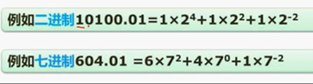

## 数据表示 

### 进制转换

R进制转十进制：按位按权展开

十进制转R进制：短除法

**每3位二进制转1位八进制，每四位二进制转1位十六进制，位不足补零**

---

### 原码反码补码移码

移码：补码的符号位取反，意义也取反

取值范围

移码是补码符号位取反 取值范围相同

---

### 浮点数运算

对阶：指数相同
结果格式化：满足科学计数法

规定尾数的最高数位必须是一个有效值，即1/2<IF<1。
在尾数用补码表示时，规格化浮点数应满足尾数最高数位与符号位不同，即当1/2<IFI1时，应有0.1xx...x形式;当-1<M<-1/2 时，应有 1.0xx...X形式。

求浮点数的范围
浮点数所表示的数值大小为：**尾数×2的阶码次方**
 对于阶码：101110为[补码](https://so.csdn.net/so/search?q=%E8%A1%A5%E7%A0%81&spm=1001.2101.3001.7020)，符号位不变取反加一为110010 = -18

对于尾数：00100011原反补相同 = 

所以表示的浮点数为：（）* 2的-18次幂

浮点数相加的步骤：
对阶再进行小数向大数对齐，加减，规格化结果。

阶码决定范围 尾数决定精度

---

## CPU结构

由运算器和控制器构成

运算器的职能是运算 控制器的职能是控制运算

CPU先把指令弄到DR，在弄到IR解析。

AC：通用的储存值的地方
DR：储存数据
PSW：存储标志位（状态信息）

PC：存放下一条指令地址，以及计数；原理就是初始化后+1，遇到转移指令加上偏移量
IR：存放指令

CPU译码器的作用是进行指令译码，确定指令类型和操作以及寻址方式，再将相应的控制指令发给相关部件。

---

## Flynn分类法

计算机体系结构的分类方法，分类计算机；
指标：（单个、多个）指令流，（单个，多个）数据流。

SISD还存在于单片机系统；
SIMD主要的代表是阵列处理机；
MISD只是理论模型，不具有实际价值；

---

## CISC和RISC

**考察**：四个选项描述CISC或RISC，选择正确的描述。
CISC是在计算机未广泛应用时提出的，在指令库上编程来实现业务，根据用户使用不同的指令，指令数量多；计算机广泛应用后，为了减低使用成本，精简指令系统。

RISC 指令长度固定 种类少 寻址方式少 增加了寄存器数目 硬布线电路   流水线操作

---

## 流水线

概念：流水线是指在程序执行时多条指令重叠进行操作的一种准**并行处理**实现技术。各种部件同时处理是针对不同指令而言的，它们可同时为**多条指令的不同部分**进行工作，以提高各部件的利用率和指令的平均执行速度。

各个部件处理指令的不同部分，提高运行效率。

与流水线执行相对的是顺序处理。

计算：
流水线周期为执行时间最长的一段。
计算公式：

考试优先使用理论公式。

流水线的吞吐率计算：
单位时间内流水线所完成的任务数量。

明确计算流水线的实际处理时间：n个任务 n-1个周期加一整段

加速比：不使用流水线的时间/使用流水线的时间

---

## 层次化存储结构

速度越快，容量越小。

Cache虽然不是必须的，但能极大地提高内存与CPU的交换效率。

Cache的存储单位为K或M，内存为G；所以只要将部分频繁执行的语句放入Cache使之与CPU快速频繁交互，即可提高运行效率。

Cache是一种性价比方案，提高速度的同时成本也不高。

## 具体存储器

### Cache

- 功能:在层级存储结构中位于CPU和内存之间，极大地提高了CPU数据输入输出的速率。

- 在计算机的存储系统体系中，Cache是访问速度最快的层次。

<< 寄存器容量极小而且存在于CPU中，所以很多时候没把它当做最顶级的存储器看待。

- 使用Cache改善系统性能的依据是__程序的局部性原理__。

---

命中：CPU在Cache中读取到需要的数据。

未命中的话，CPU就要从内存中读取。

此公式是Cache提高运行效率的证明。

**cache命中率并不随容量的扩大而线性增加。**

### 局部性原理

- 时间局部性：计算机在某一时段集中地访问某些指令或数据。
- 空间局部性：集中地访问某一相邻的数据段。
- 工作集理论：工作集是进程运行时被频繁访问的页面集合。

## 主存

### 分类

随机存取存储器（内存属于，断电后内存里的数据丢失

- DRAM 动态RAM，作为主存和图形系统的帧缓冲区，**主存的主要构成部分**，使用电容存储，周期性刷新
- SRAM 静态RAM，比DRAM快且贵，作为Cache

只读存储器（断电后任然能存储相应的信息

- MROM（Mask ROM，掩模式ROM
- PROM（可编程ROM
- EPROM（可擦除PROM
- 闪存存储器（flash memory

### 编址

将芯片组成存储器

C7FFFH+1-AC000H->转十进制除以1024得112；

112K×16除以（28×16K×X）等于1 解得X=4

为什么是112×16？因为地址单元转化为位。

答案为B,A。

## 磁盘工作原理

磁盘的盘面用来保存数据，磁头来读取数据。

此题要注意是单缓存，所以一次只能处理一条记录。

最坏的情况就是刚处理完缓冲区，磁头刚好错过要读取数据的扇区。

最好的情况就是刚处理完缓冲区，磁头刚好来到要读取数据的扇区。

答案为C,B。

**磁道最优寻址算法**：先到距离最近的数据所在的磁道，在到其所在扇区，以此类推直至所有数据寻找完毕。
单向扫描，从头扫到尾，然后再**循环**下去。

**硬盘（磁盘）容量**分为非格式化容量和格式化容量两种，**计算**公式如下：

- 非格式化容量=面数×（磁道数/面）×内圆周长×最大位密度
- 格式化容量=面数×（磁道数/面）×（扇区数/道）×（字节数/扇区）

在算磁道数时记得除以2，因为从一截面统计会统计两倍。

## 计算机总线

根据总线的位置，分为：

- 内部总线

- 系统总线

  按传送内容分为：

  - **数据总线**
  - **地址总线**
  - **控制总线**

- 外部总线

SCSI不属于系统总线，ISA、EISA、PCI都属于系统总线。

## 串联系统与并联系统的可靠度计算

- 串联系统

串联系统的可靠度就是每个子系统可靠度的累乘。失效率就是一减去可靠度。

- 并联系统

失效就是所有子系统同时失效，所以可靠度就是一减去这一概率。

- n模冗余系统（不考

R1，R2，...，Rm都是独立计算的子系统，表决器输出的结果取决于各子系统的输出结果。

- 混合系统

## 校验码的概念

## 循环校验码CRC

只可以检错，**不能纠错**。

模2除法：不考虑进位。

n位生成多项式，就补n-1个0。

## 海明校验码（重要，常考

遵循的公式：2^r^>=n+r+1 r为校验码的位数 n为信息码的位数

校验码放在生成码的2的0..r次方位上。

如何判断信息位收到哪些位的校验码检测呢？ 答案是化为二进制形式。

I~5~ -> 101 收到r2和r0的校验。

**海明码还能纠错**；由于信息位收到不同校验位的校验，假设只有一位出错，通过异或重新验证检验位来排除和确定出错的信息位。

## 性能指标（CPI和MIPS

主频
理解：主频是机器内部主时钟的频率，主频越高，完成指令的一个执行步骤所用的时间就越短，速度越快。比如跳绳，跳的越快（即频率越高），那么完成一次所用的时间就越短。

单位：Hz，常见的有1.8GHz，2.4GHz

CPU时钟周期
理解：跟上面的主频对应，CPU时钟周期是一个时间单位，即一个周期的时长

计算：CPU时钟周期=1/主频

单位：s（秒）（ms，μs等）

CPI
理解：我们借助英文全称理解，全称为：Clock cycle Per Instructions，即一条指令所需要的时钟周期数。需要注意的是这个是需要的**时钟周期数**，不是时钟周期。

计算：CPI = 程序所需时钟周期数 / 程序所含指令数（把周期数平分为n份，n为指令数，即求得每条指令所需要时钟周期数，这里计算的是平均值，一般情况下均计算平均值）

单位：周期数/每条指令（根据算式得的，一般没要求，这里为了帮助理解）

MIPS
理解：同样借助英文全称，Million Instructions Per Second，即每秒执行多少百万条指令。通俗即一秒之内可以跑多少百万条指令。

计算：MIPS = 指令条数 / （执行时间*10^6） （除以10^6为了求得有多少百万条指令）

推导:执行时间 = CPI * 指令条数 * 时钟周期 = CPI * 指令条数 * （1/主频）（这里需要理解透彻CPI到底是什么意思）代入上式可得：MIPS = 主频 / (10^6 * CPI）
