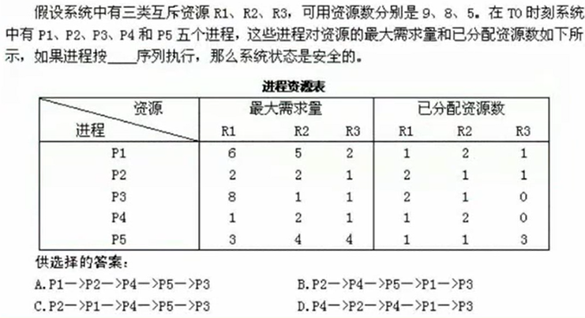
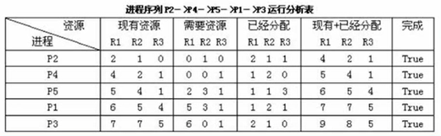

==**操作系统在软考中考5到7分**==

## 进程管理

### 进程状态转换

三态模型：等待状态不能直接转换到运行状态，要先进入就绪状态，等待CPU分配。

五态模型：活跃就绪对应三态的就绪状态，活跃阻塞对应三态的等待状态。

### 前驱图

表达一系列活动的先后约束关系。

哪些活动可以并行，哪些必须得先后执行。

### 进程的同步与互斥

互斥与共享 同步和异步

互斥：对于一个资源来说，在某一时刻，只能被生产者搬进去或消费者搬出去。

同步：生产者得等消费者消费完才能继续搬东西。

### PV操作

P是申请资源 V是释放资源 S是信号量

- 临界资源:诸进程间需要互斥方式对其进行共享的资源，如打印机、磁带机等
- 临界区:每个进程中**访问临界资源的那段代码**称为临界区
- 信号量:是一种特殊的变量，PV操作所依据的信号

PV操作所解决的问题就是并发关系的某些约束问题。

答案：A C
解析：由于收银员进行收银职能的前置条件是顾客进行了付款，否则毫无意义。所以a1就是来唤醒收银员进程的，V(S1)。b1就是P(S1),表示进行收银。收银完毕，要告知顾客，即重新唤醒购书者进程，V(S2)，可以理解为给你小票。a2是P(s2)，意味着拿走小票。

### PV操作与前驱图

前驱图反映的是各个进程之间的依赖关系。

进程D需要进程ABC来共同解锁/唤醒。

答案：C A  A

### 死锁问题

所有进程在等待别人释放资源，自己不释放，互相等待。

不发生死锁的最少资源数：各个进程所需资源-1的累加+1。

p1 1,1  0,1
p2 1,2 1,0

入度代表已分配，出度代表所需；

P1，P2是阻塞节点，因为申请的资源得不到满足；

因为借助银行家算法不可以满足P1和P2，会产生死锁，所以该图不可以化简

### 死锁的预防和避免 银行家算法

- 互斥：资源不共享
- 保持和等待：进程占有资源，并且其他进程释放资源
- 不剥夺：系统不主动剥夺进程所占有的资源
- 环路等待：进程等待队列中出现环路

有序资源分配法：先给A，再给B，…… 资源利用率低

在同一进程中的各个线程都可以共享该进程所拥有的资源，如访问进程地址空间中的每一个虚地址；访问进程拥有已打开文件、定时器、信号量机构等，**但是不能共享进程中某线程的栈指针**。             

银行家算法：优先满足可以满足的，递归下去。

## 存储管理

### 分区存储组织

存储空间有一部分是分配给用户使用的，这一部分是分区进行组织的。就好比有多个尺寸不同的箱子给你装东西一样。

分配策略：

- 首次适应：从上往下，第一个放得下的。
- 最佳适应：将空闲空间排序，选择放得下的最小空间，使得浪费最少。
- 最差适应：选择放得下的最大空间，使得浪费最大。
- 循环首次：从上次分配完的位置出发，循环搜索。

---

### 页式存储组织

将用户程序等分为n页，运行哪些页就通过页表调入相应的块。
页表是在内存中的。

优点:利用率高，碎片小，分配及管理简单
缺点:增加了系统开销（查询页表;可能产生抖动现象

**一整段数据是可以跨页存储的。**

主要考察逻辑地址转化为物理地址。

**物理地址：块号+页内地址**
**逻辑地址：页号+页内地址**

页面大小为2的12次方 页内地址为12位 所以页内地址为A29 查表 知道页号5对应块号6

---

### 段式存储组织

逻辑地址：段号+段内地址
按逻辑来划分，比如一个函数是一段，另一个函数是一段，**各个段的大小不一样**。

- 优点:多道程序共享内存，各段程序修改互不影响
- 缺点:内存利用率低，内存碎片浪费大

---

### 段页式存储组织（常考

查完段表查页表

- 优点:空间浪费小、存储共享容易、存储保护容易、能动态连接
- 缺点:由于管理软件的增加，复杂性和开销也随之增加，需要的硬件以及占用的内容也有所增加，使得执行速度大大下降

---

### 快表

快表是一块小容量的相联存储器 (Associative Memory)，由高速缓存器组成速度快，并且可以从硬件上保证按内容并行查找，一般用来存放当前访问最额繁的少数活动页面的页号。

特点：速度非常快，效率非常高。

---

页面置换（淘汰）算法

- 最优算法 理论上的（不常考
- 随机算法 效率不稳定（不常考
- 先进先出算法 有可能产生抖动 抖动：分配了更多的资源反而使得效率、性能降低了
- 最近最少使用（LRU）算法 不会抖动

缺页：内存中没有对应的页
为什么要淘汰页面 根本原因是内存有限

抖动的具体表现：

FIFO与LRU的区别

答案：B C

想问页表，在访问在内存中的物理地址；
默认规则就是无论**指令跨多少页只会产生一次缺页中断，而数据跨多少页就产生多少次数据中断**。

---

## 文件管理

### 索引文件结构

索引级别与存储容量的拓展有关，索引级别越高，拓展容量越多，访问效率越低。

直接索引就是就是对存储数据的地址的映射，就是存放数据的物理地址。
多级索引是对存储索引的地址的映射。

答案：C D

---

### 树形目录结构

绝对路径与相对路径

---

### 位示图法（空闲存储空间管理的方法

空闲存储空间管理的方法：

- 空闲区表法

  使用表来记录空闲位置

- 空闲链表法

  将空闲区链接成链表，使用时划分一个区域出来

- **位示图法（高频考**

  **每一位对应一个物理块，使用0/1表示空闲或占用**

- 成组链接法

答案：D B
要点是第几个位置 位是从0开始的 有第0位

---

### 对磁盘的操作

- **磁盘格式化**是指把一张空白的盘划分成一个个小区域并编号，以供计算机储存和读取数据。格式化是一种**纯物理操作**，是在磁盘的**所有数据区上写零**的操作过程，同时对硬盘介质做一致性检测，并且标记出不可读和坏的扇区。由于大部分硬盘在出厂时已经格式化过，所以只有在硬盘介质产生错误时才需要进行格式化。 
- **磁盘分区**就是将磁盘**划分成一块块的存储区域**。在传统的磁盘管理中，将一个硬盘分为两大类分区：主分区和扩展分区。主分区是能够安装操作系统、能够进行计算机启动的分区，这样的分区可以直接格式化，然后安装系统，直接存放文件。 磁盘里的文件都是按存储时间先后来排列的，理论上文件之间都是紧凑排列而没有空隙的。但是，用户常常会对文件进行修改，而且**新增加的内容**并不是直接加到原文件的位置的，而是**放在磁盘存储空间的最末尾**，系统会在这两段之间加上联系标识。当有多个文件被修改后，磁盘里就会有很多不连续的文件。**一旦文件被删除，所占用的不连续空间就会空着，并不会被自动填满，而且，新保存的文件也不会放在这些地方**，这些空着的磁盘空间，就被称作“**磁盘碎片**”。因此，硬盘的每个分区里都会有碎片。碎片太多，其他的不连续文件相应也多，系统在执行文件操作时就会因反复寻找联系标识，工作效率大大降低，直接的反映就是感觉慢。 
- **磁盘清理**是删除计算机上所有不需要的文件（这些文件由用户或系统进行确认）。 
- **磁盘碎片整理**，就是通过系统软件或者专业的磁盘碎片整理软件对电脑磁盘在长期使用过程中产生的碎片和凌乱文件重新整理，**释放出更多的磁盘空间**，可提高电脑的整体性能和运行速度。             

---

## 设备管理

### 数据传输控制方式

指**内存与外设**之间的数据传输的方式

- 程序控制（查询）方式

  最低级 **CPU主动查询外设信息** 外设不主动反馈信息 所以CPU要一直查询

- 程序中断方式

  外设完成传输 主动发出中断信号 CPU在此之前可以执行其他任务

- DMA方式（直接存取控制方式
  CPU是在**一个总线周期**结束时响应DMA请求的。

  整个过程有DMA控制器来监管完成 CPU只需下达指令和处理DMA控制器的反馈

- 通道

- 输入输出处理机

### I/O设备管理软件

I/O设备管理软件一般分为4层：**中断处理程序、设备驱动程序、与设备无关的系统软件和用户级软件**。
至于一些具体分层时细节上的处理，是依赖于系统的，没有严格的划分，只要有利于设备独立这一目标，可以为了提高效率而设计不同的层次结构。I/O软件的所有层次及每一层的主要功能如下图所示。  

**当用户通过键盘或鼠标进入某应用系统时，通常最先获得键盘或鼠标输入信息的程序是中断处理程序。** 

---

 ### 常用的I/O接口编址

有两种：一是与内存单元统一编址，二是单独编址。
与内存单元统一编址方式下，是**将I/O接口中有关的寄存器或存储部件看作存储器单元**，与主存中的存储单元统一编址。这样，内存地址和接口地址统一在一个公共的地址空间里，对I/O接口的访问就如同对主存单元的访问一样，可以**用访问内存单元的指令访问I/O接口**。 I/O接口单独编址是指通过设置单独的I/O地址空间，为接口中的有关寄存器或存储部件分配地址码，**需要设置专门的I/O指令进行访问**。这种编址方式的优点是**不占用主存的地址空间**，访问主存的指令和访问接口的**指令不同**，在程序中**容易使用和辨认**。                        

---

### 虚设备和Spooling技术

spooling关键在于开辟了缓冲区，将输入或输出的数据缓存起来，缓解进程争用外设的情况。

### 缓冲区

**单缓冲区**

当从磁盘读入一个单位数据文件到缓冲区后，缓冲区是忙碌的，所以不能再再读入，要等缓冲区输出完数据后再可以继续读入。

**双缓冲区**

**要注意的点是用户进程的工作区只能同时连接一个缓冲区来接受数据以及I、O设备只能与一个缓冲区建立连接。**

---

## 微内核操作系统

Q：为什么需要微内核？
A：原来单体内核操作系统太大，一旦部分出错会使整个系统出错，所以将最为核心的部分提取为微内核，其他作为外接部分，在一样的功能实现下，微内核更为可靠和稳定。

**要了解用户态和核心态的构成部分**

关键的部分再去核心态里面处理。

     
