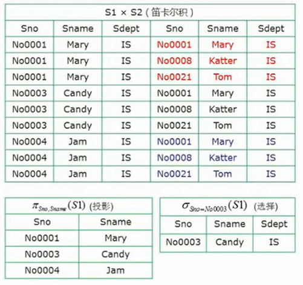
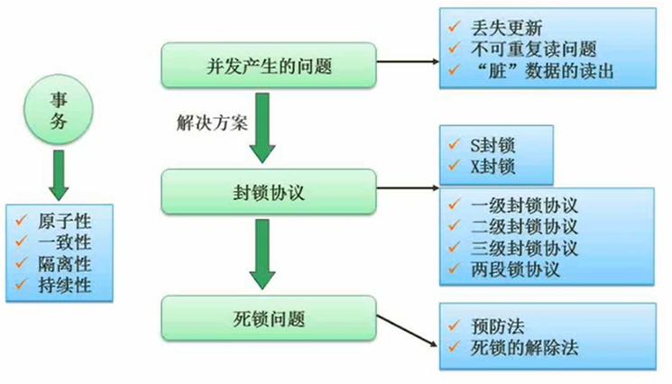

## 数据库模式

### 三级模式—两级映射（选择题

内模式：定义了数据存放的格式和方式
概念模式：表
外模式：用户视图

外模式-概念模式映射：表到视图的映射关系 表变化 改映射关系 
概念模式-内模式映射：存储结构到逻辑表的映射

**聚集索引**是指数据库表行中数据的**物理顺序**与键值的**逻辑（索引）顺序**相同。所以生成或改变聚集索引影响的是**内模式**。

---

### 数据库设计过程

用户**需求分析阶段形成的相关文档**用以作为**概念结构设计的设计依据**。             

---

## ER模型

矩形：实体 菱形：联系 椭圆：属性

没有语义冲突

属性分为简单，多值，复合和派生；家庭包含省市，属于复合属性。
对实体中的多值属性，**取实体的码和多值属性构成新增的关系模式**，且该新增关系模式中，实体的码多值决定多值属性，属于平凡的多值依赖，关系属于4NF。多值是指实体在该属性会取多个值。  

每一个实体都要转成一个关系模式；

在一对一联系中，联系可以加入任一边实体或不转；
在一对多联系中，联系作为属性加入多的实体；
在多对多联系中，联系要单独转化为一个关系模式。

---

## 关系模型

采用**二维表**表达**实体类型及实体间联系**的数据模型是关系模型；

---

## 关系代数与元组演算

**并、交、差**属集合运算
   

**笛卡尔积投影选择**

**联接**：没写连接就是自然连接 自动连接（覆盖）相同字段

**对于连接后的投影，特有部分不用写属于谁的，共有部分就要表明。**

## 规范化理论

### 函数依赖

在传递依赖中，如果B还能确定A，说明AB等价，就不存在“传递”了。
A确定BC，蕴含A确定B，A确定C。

### 规范化理论 - 价值与用途
非规范化的关系模式，可能存在的问题包括:**数据冗余、更新异常、插入异常、删除异常**
关系模式的规范化也在逻辑设计阶段进行

Q&A：是不是规范化程度越高越好？不见得如此。因为有好也有坏，后面便出现逆规范化，加冗余。

此表中DNO和DNAME是等价的，属于数据冗余 改变其中一个还要改变另一个 属于更新异常

### 键

全码：所有属性组是关系模式的候选键。

候选键是最小的超键。
主键的设置是为了表的关联。

---

### 求候选键

答案为ABCD。

答案为：A**和**B

### 范式（必考

规范化程度越高，数据的密度越小。数据被拆分得越来越细。所以一般规范到第三范式。

该关系不满足2NF，CREDIT部分依赖主属性。
显然，重复存储了同一科目的学分，属于数据冗余。若要更新一个科目的学分，又要更新下面的学分，更新异常。插入一个新的科目，但没有SNO和GRADE，属于插入异常。

只有一个字段的主键肯定满足2NF。存在非主属性对主属性的传递依赖。

使用定义判断是不是BCNF。

候选码为SJ和ST，有依赖：SJ确定T，T确定J，显然，起决定的不都是候选码，所以不属于BCNF。

---

### 模式分解

**DF分解**（保持函数依赖分解）：原来的依赖在分解后依旧保持。不用考虑冗余的函数依赖。

**无损分解**，无损就是可以还原的意思，将一个关系模式分解成若干个关系模式后，通过自然联接和投影等运算仍能还原到原来的关系模式。     

判断无损连接的方法：

画表：

公式：

如果R与R的公共属性能函数决定R1中或R2中的其它属性，这样的分解就具有无损联接性。

## 并发控制

### 事务：有关联的操作的序列。

- 原子性：不可拆分；
- 一致性：A+100，B-100，结果是一致的。（能量守恒？？）
- 隔离性：事物互不影响，各自不可见；
- 持续性：一旦提交成功，对数据库的更新操作就是永久性的

数据库管理系统**DBMS利用日志文件来进行事务故障恢复和系统故障恢复**。在事务处理过程中，DBMS把事务开始、事务结束以及对数据库的插入、删除和修改的每一次**操作写入日志文件**。当系统正常运行时，**按一定的时间间隔**，把**数据库缓冲区内容写入数据文件**；一旦发生故障，DBMS的**恢复子系统利用日志文件**撤销事务对数据库的改变，回退到事务的初始状态。             

数据库中的4类故障是事务内部故障、系统故障、介质故障及计算机病毒。
（1）事务内部故障。事务内部的故障有的可以通过事务程序本身发现。但有些是非预期的，不能由事务   程序处理，例如运算溢出、并发事务发生死锁等。
（2）系统故障。通常称为软故障，是指**造成系统停止运行的任何事件**，使得系统要**重新启动**。
（3）介质故障。通常称为硬故障，如磁盘损坏、磁头碰撞和瞬时强磁干扰。此类故障发生的几率小，但破坏性最大。
（4）计算机病毒。             

### ConCurrent产生的问题：

### 封锁协议

## 数据库完整性约束

- 实体完整性约束
  主键，不可重复不为null
- 参照完整性约束
  外键：要么为null，要么为参照关系里的属性值
- 用户自定义完整性约束

触发器：写脚本来约束数据，适用于复杂约束。

### 数据库安全

**措施**：

- 用户标识和鉴定

  **身份验证 最外层**的安全保护措施，可以使用用户帐户、口令及随机数检验等方式

- 存取控制（访问控制

  对用户进行**授权**，不同级别的用户有不同的权限，包括操作类型(如查找、插入、删除、修改等动作)和数据对象(主要是数据范围)的权限。

- 密码存储和传输

  对远程终端信息用密码传输

- 视图的保护

  对视图进行授权，不同权限的用户有不同的视图

- 审计
  使用一个专用文件或数据库，自动**将用户对数据库的所有操作记录下来**

### 数据备份与恢复

数据库恢复就是在尽可能短的时间内**把数据库恢复到故障发生前的状态**。             

- 冷备份

  也称为静态备份，是将数据库正常关闭，在**停止状态**下，将数据库的文件全部**备份**(复制)下来。
  如果你把数据库关闭了，应用无法提供服务。文件层次的备份意味着无法精确到备份哪一张表。

- 热备份

  也称为动态备份，是**利用备份软件**，在数据库**正常运行**的状态下，将数据库中的数据文件备份出来。
  可以精确备份到表层次，恢复起来也快。

**备份类型**（依据是备份数据的量：

- 完全备份:备份所有数据
- 差量备份:仅备份上一次**完全备份**之后变化的数据
- 增量备份:备份**上一次备份**之后变化的数据

Q&A：为什么会有差量备份和增量备份呢？因为在多次增量备份下，假设出故障，要先从完全备份开始，恢复增量备份1234等等，恢复得慢，所以提出差量备份，可以从完全备份调到差量备份再增量备份。

**转储类型**：

- **静态海量**转储:在系统中**无运行事务**时进行，每次转储**全部**数据库
- **静态增量**转储:在系统中**无运行事务**时进行，每次只转储**上一次转储后更新过**的数据。
- **动态海量**转储: 转储期间**允许对数据库进行存取或修改**，每次转储**全部**数据库。
- **动态增量**转储: 转储期间**允许对数据库进行存取或修改**，每次只转储**上一次转储后更新过的**数据。

**日志文件 :**事务日志是针对数据库改变所做的记录，它可以**记录针对数据库的任何操作**，并将记录结果保存在独立的文件中。
Q&A：为什么要有日志？因为备份是存在时间间隔的，要通过记录的操作恢复这段时间内的数据修改。

---

### 故障与恢复

---

## 数据仓库与数据挖掘

广泛应用于BI 商业智能

**数据库**里的数据是**面向应用**的，需要频繁修改的；**数据仓库**其实就好比杂物仓库，将一些目前没用但或许有参考价值的数据存放在里面，这类数据是不需要频繁修改的。

特点：

- 面向主题

- 集成的

  直接存储报表等集成数据

- 相对稳定的(非易失的)

- 反映历史变化(随着时间变化)

  因为数据的录入具有周期性，更加数据的变化反应发展

数据挖掘的方法和分类

## 反规范化

由于规范化会使表不断的拆分，从而导致数据表过多。这样虽然减少了数据冗余，提高了增、删、改的速度，但会增加查询的工作量。系统需要进行多次连接，才能进行查询操作，使得系统效率大大下降。

为了方便查询 我们可以增加冗余。

**技术手段**：

- 增加派生性冗余列

  为了方便计算数量 增加了派生属性金额

- 增加冗余列

  为了方便知道哪一个人考虑多少分 增加姓名字段

- 重新组表

- 分割表

---

## 大数据（图一乐

