## OSI/RM七层模型

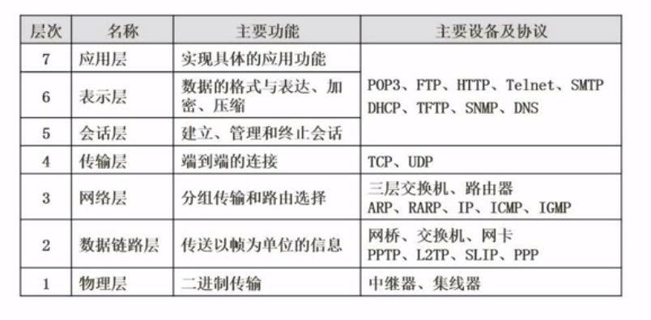

理论模型

VLAN参考OSI的数据链路层

掌握各层的典型设备

数据链路层的设备可以识别帧，对帧进行操作；物理层可以检测冲突，但也只能传输和接收帧。

集线器连接的主机构成一个冲突域，**交换机的每个端口属于一个冲突域**，路由器连接的两部分网络形成两个广播域，所以共有两个广播域和5个冲突域。             

## 网络技术标准与协议

- TCP/IP协议:Internet，可扩展，可靠，应用最广，牺牲速度和效率，建立连接**可靠传输是在传输层**进行的。
- IPX/SPX协议:NOVELL，路由，大型企业网
- NETBEUI 协议:IBM，非路由，快速
- telnet是一种TCP远程登录协议。

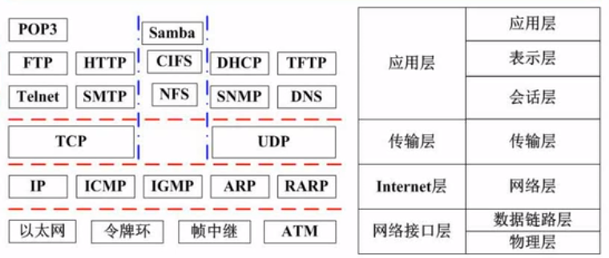

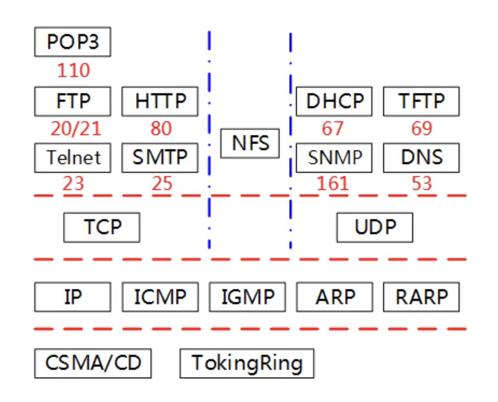

### DHCP协议

- 自动分配IP地址
- 续约机制
- C/S模型
- 若分配到的地址为169.254.X.X和0.0.0.0(假地址)，则可能没成功与DHCP服务器连接上

DHCP客户端可从DHCP服务器获得本机IP地址、**DNS服务器的地址、DHCP服务器的地址、默认网关的地址**等，但没有Web服务器、邮件服务器地址。             

DNS协议

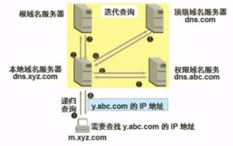

- 主机向本地域名服务器的查询采用**递归查询**。
- 本地域名服务器向根域名服务器的查询通常采用**迭代查询**（根域名服务器负担重，效率低故较少采用）。
- 解析域名会**先在本地hosts文件**查询对应IP，再去本地DNS服务器查询。

HTTPS协议与HTTP协议

HTTPS是以安全为目标的HTTP通道，**HTTPS**是HTTP的安全版，**使用SSL和TLS加密协议做加密传输**。HTTP使用80端口，HTTPS 使用端口443。
FTP的端口为20和21,20为数据口，21为控制口。  

ARP协议
将IP地址转化为MAC地址，位于网络层。

PPP协议
支持两种认证方式：口令验证协议（PAP）和质询握手认证协议（CHAP）

SNMP协议 简单网络管理协议
属于应用层 在传输层是UDP协议

SMTP（简单邮件传输协议），用于发送邮件，传输的邮件报文采用ASCII码表示，端口为25。POP3是TCP/IP中用于接收邮件的协议，使用C/S模式，端口为110。MIME是一个拓展邮件标准，支持传输多媒体数据。

ASP对象中，response对象可以创建和修改cookie，request访问的是cookie的参数。

## 计算机网络的分类

- 按分布范围分
  局域网(LAN)
  城城网(MAN）
  广域网(WAN)
  因特网，全球性

- 按拓扑结构分

  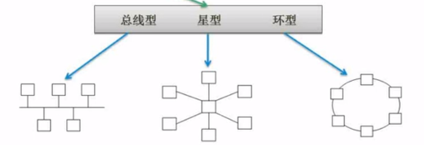

星型结构存在单点故障的问题，环形不存在。

## 网络规划与设计

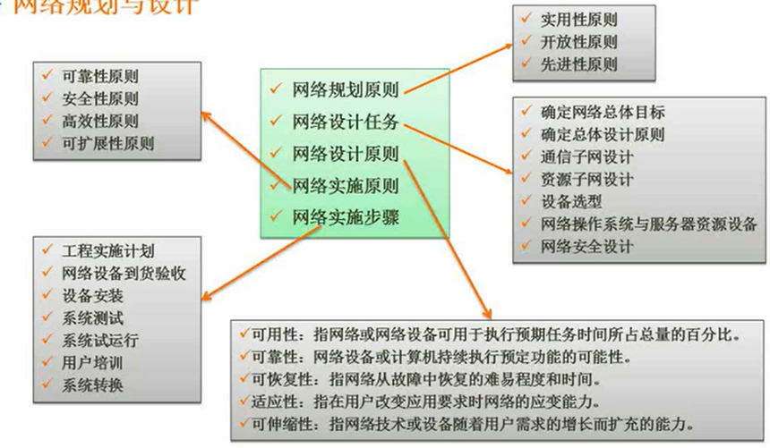

逻辑网络设计

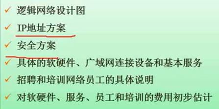

物理网络设计

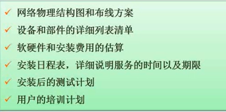

### 分层设计（考得多

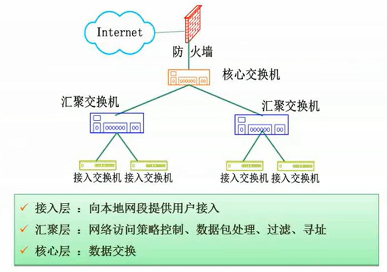

核心层有冗余设计，保障可靠性。

## IP地址与子网划分

地址的分类 

求子网掩码

无分类地址：网络前缀+主机号

### 特殊含义的IP地址

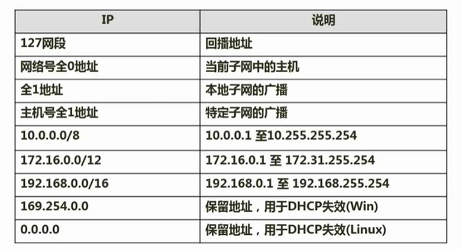

本地回播地址：127.0.0.1  

计算地址数时，要记得减掉网段和广播地址。

如果要使得两个IPv6结点可以**通过现有的IPv4网络**进行通信，则应该使用**隧道**技术，如果要使得纯IPv6结点可以与纯IPv4结点进行通信，则需要使用**翻译**技术。

VLAN技术，允许有逻辑地划分网段。

主机路由的子网掩码是255.255.255.255

---

HTML(偶尔考，但作为程序员要掌握)

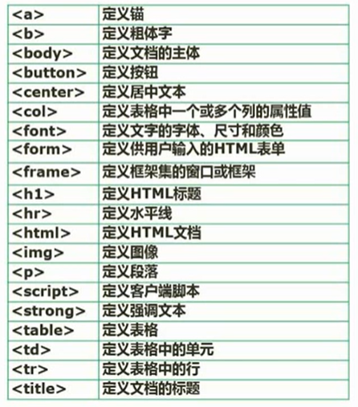

### 无线网

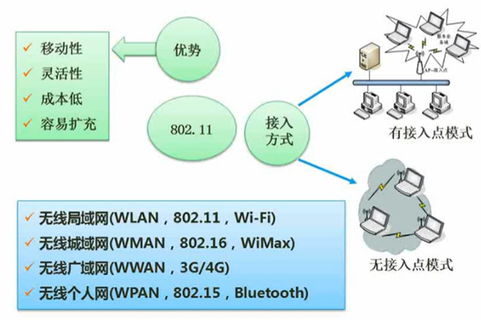

### 网络接入技术(不用考)

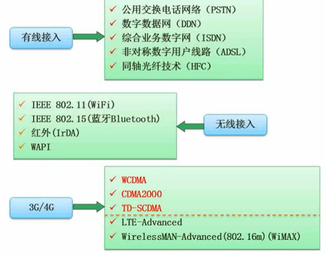

### IPV6

地址长度为128位
新特点：身份认证和隐私权，简化了报文头部格式。
