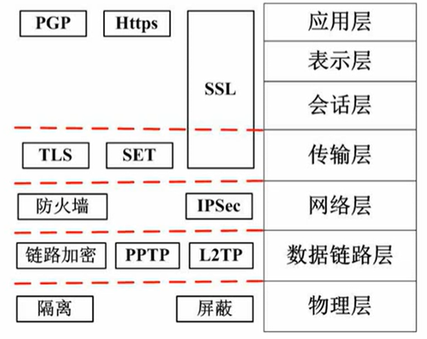

## 安全属性

**安全分类：**

- 物理安全，真实世界的
- 网络安全，网络层的
- 系统安全
- 应用安全，某一具体应用上

---

## 加密技术

防范网络监听最有效的方法是数据加密传输。

###  非对称加密（公开秘钥加密

公钥是可以给任何人知道的
使用甲的公钥加密 要使用甲的私钥来解
所以甲要发信息刚给乙，要使用乙的公钥加密，乙使用自己的私钥来解。

非对称加密不适合数据量很大的信息。

### 对称加密（共享密钥加密

对称：即解密的过程就是把加密反过来。

使用非对称加密来分发对称加密的秘钥。

**私钥就是来解密和签名的。**

**公钥就是用来认证和加密的。**

### 信息摘要

本质：信息的**特征值**。

用于验证信息在传输过程有没有变化或被修改 一种检错机制 原理是比对前后的信息摘要是否一致
单向：哈希值无法还原成原文 原文可以被映射成哈希值

**MD5，SHA属于摘要算法，各自的散列值分别为128位和160位。**

不能用来加密 就是因为其单向性 不能还原

---

## 数字签名

一般步骤：A使用私钥加密，别人使用A的公钥就知道是A发送的数据包。
数字签名没有保密的职能。在非对称加密中，只对摘要签名。

可用于数字签名的算法是RSA。

## 数字证书

包含发送方的公钥 证明自己的身份和识别对方的身份 由CA机构颁布 有CA的签名 使用CA的公钥验证证书的有效性。

某网站向CA申请了数字证书，验证该网站（数字证书）的真伪就要使用CA的签名进行验证。

---

### 数字信封与PGP

**原文对称加密 秘钥非对称加密**

与电子邮件安全性有关的协议https，ssl，PGP。

X509使用RSA，国密使用ECC。

练习题

### 各个网络层次的安全保障

记住哪个协议在哪个层就行。

ssl协议可以有效防止远程管理中的信息泄露问题。

https=http+ssl

## 网络威胁与攻击

**分类**：

- 主动攻击

  主动攻击包含攻击者访问他所需信息的故意行为。攻击者是在**主动地做一些不利于**你或你的公司系统的事情。主动攻击包括拒绝服务攻击 (DoS)、分布式拒绝服务 (DDOS)、信息篡改、资源使用、欺骗、伪装、重放等攻击方法。

- 被动攻击

  主要是收集信息而不是进行访问，数据的合法用户对这种活动一点也不会觉察到。被动攻击包括嗅探、信息收集、会话拦截等攻击方法

业务流分析，又叫流量分析：与窃听有别 长期监听 对数据统计分析  **属于被动攻击**

重放属于主动攻击，原理是发送主机接收过的包，欺骗系统，破坏认证，**可以在报文中加入时间戳避免重放攻击**。

DOS攻击可以由系统内外的用户发起，SYN flooding攻击属DOS攻击，向路由器发送大量SYN包，对路由器回复的ACk包不作回应，使得路由器维护起来浪费了大量资源。

端口攻击利用扫描端口发现系统漏洞而实施攻击。

IP欺骗伪造源IP地址，冒充他人。

Sniffer是一种被动侦听网络的技术，来监视网络，不是木马程序。

感染木马的典型表现是有未知程序企图建立网络连接。

木马程序有两个版本，客户端和服务端，客户端运行在被攻击者的电脑上，服务端运行在攻击者的电脑上。

---

## 计算机病毒的分类

计算机病毒可分为文件型计算机病毒、引导型计算机病毒、宏病毒和目录型计算机病毒。

- 文件型计算机病毒感染可执行文件(包括EXE和COM文件)。
- 引导型计算机病毒影响软盘或硬盘的引导扇区
- 目录型计算机病毒能够修改硬盘上存储的所有文件的地址
- 宏病毒感染的对象是使用某些程序创建的文本文档、数据库、电子表格等文件

---

Windows系统中 权限由高到低分别为administrators->power user->user->everyone

---

## 防火墙

特点：防外不防内 工作层次越高，工作效率越低，安全级别越高。
应用级：开箱检查

防火墙具有服务器代理的功能，但不具备检测病毒的功能。

主要掌握**屏蔽子网**，增加非军事区存放一些资源，当一道防火墙被攻破，内部还有许多道防火墙，**减少防外不防内的现象发生**。

**DMZ**是为了解决安装防火墙后外部网络不能访问内部网络服务器的问题，而设立的一个**非安全系统与安全系统之间的缓冲区**，这个缓冲区位于企业内部网络和外部网络之间的小网络区域内，**在这个小网络区域内可以放置一些必须公开的服务器设施，如企业Web服务器、FTP服务器和论坛等**

## 漏洞扫描系统

一种自动检测目标主机安全弱点的程序，依赖于系统漏洞库的完善。

入侵检测技术包括专家系统、模型检测、简单匹配，不包括漏洞扫描。
